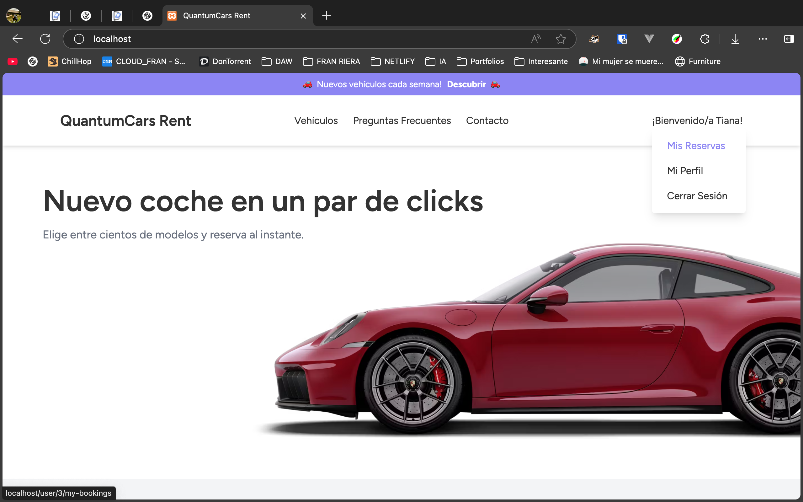
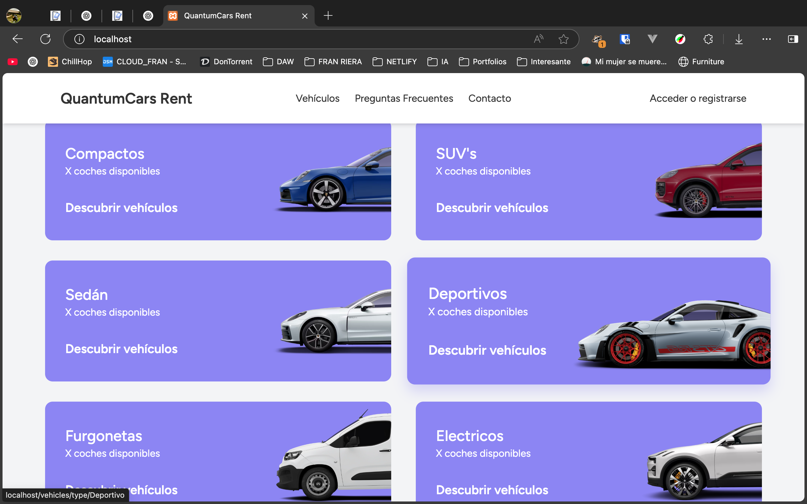
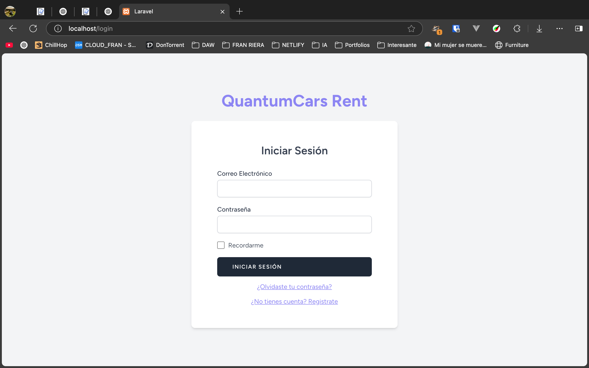
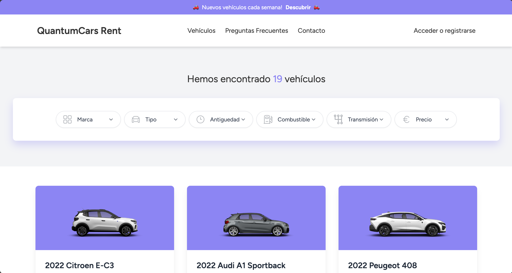
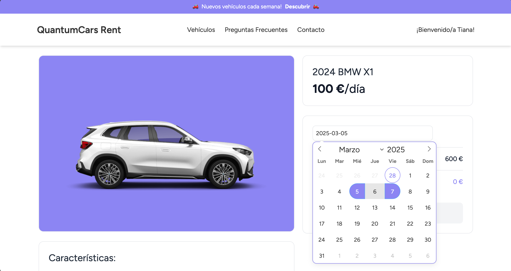
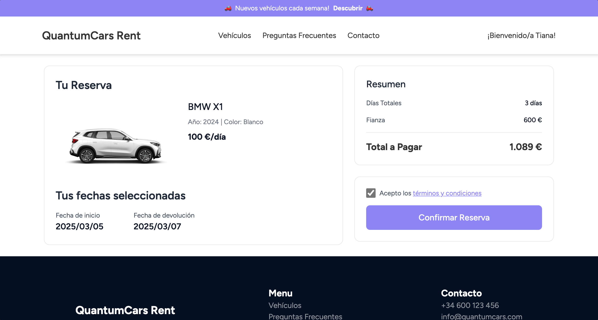
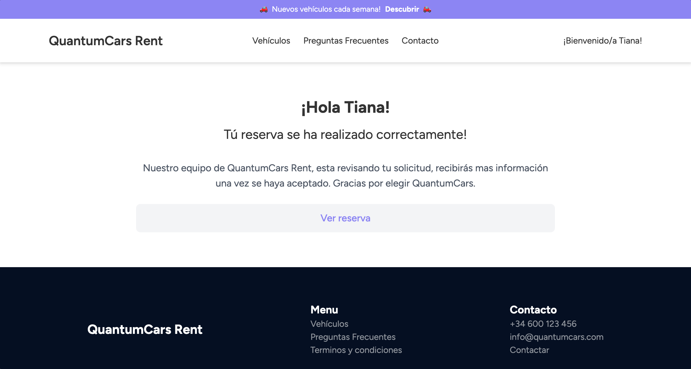
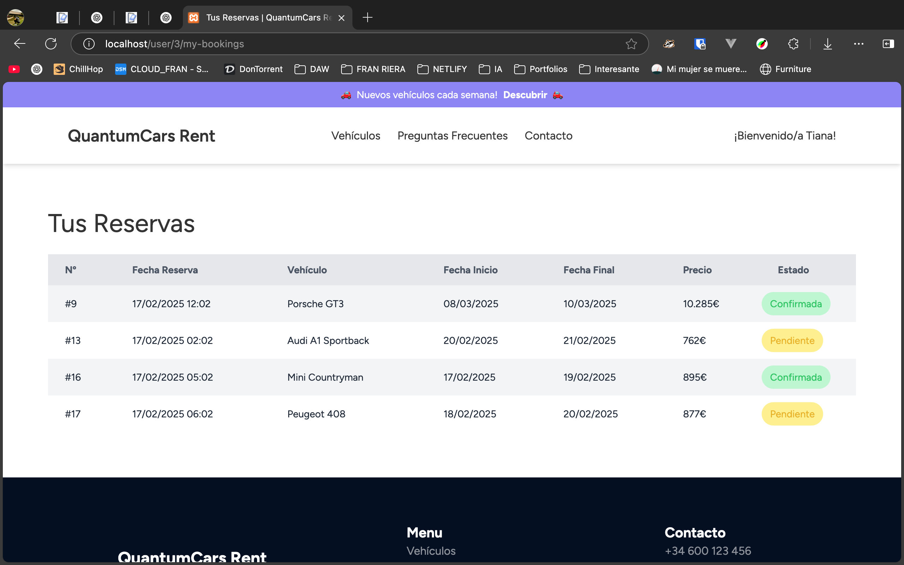
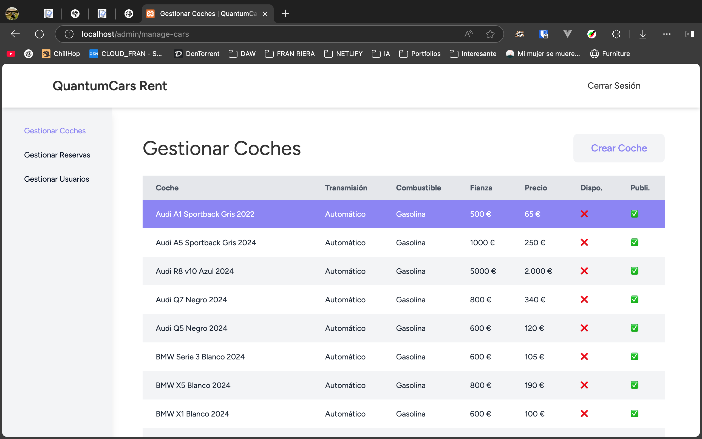
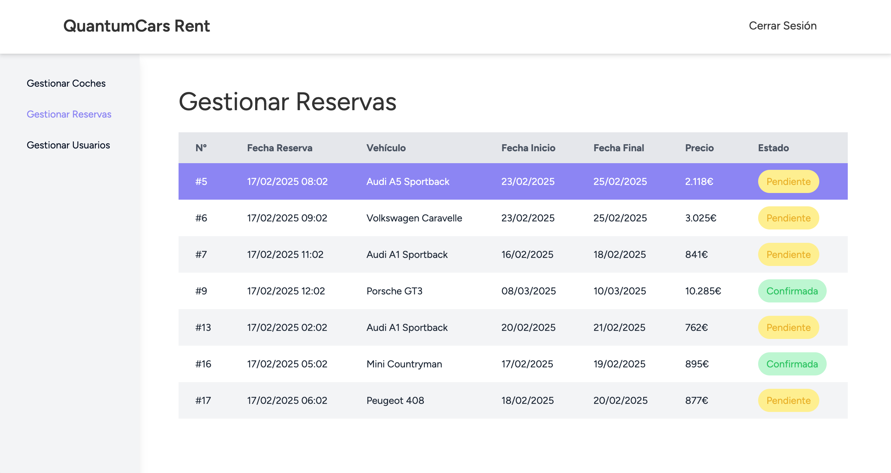

# 🚗 QuantumCars Rent 

**QuantumCars** es una plataforma de alquiler de coches que permite a los usuarios explorar, reservar y gestionar vehículos de forma intuitiva. Diseñada tanto para clientes como para administradores, ofrece una gestión eficiente del servicio de alquiler.  

## 📸 Capturas de pantalla  
A continuación, se muestran algunas capturas de pantalla de las principales funcionalidades de QuantumCars Rent:

### Inicio

*Página principal*

*Página principal - Selector por segmento*

### Login

*Página para iniciar sesión*

### Selección de vehículos

*Listado de vehículos*

### Vehiculo - Detalle

*Vehículo en detalle*

### Reserva - Cesta

*Cesta de la reserva*

### Reserva - Confirmación

*Reserva confirmada con éxito*

### Reserva - Confirmada (Cliente)

*Página de reservas del cliente*

### Gestionar Coches (Admin)

*Página de gestión de coches*

### Gestionar Reservas (Admin)

*Página de gestión de reservas*

## 🚀 Funcionalidades  
✔️ **Exploración de vehículos** con filtros avanzados.  
✔️ **Sistema de reservas** con confirmación y seguimiento.  
✔️ **Panel de administración** para gestionar la flota y las reservas.  
✔️ **Autenticación** de clientes y administradores.  

## 🛠️ Tecnologías Utilizadas  
- **Frontend:** HTML, CSS, JavaScript, TailwindCSS
- **Backend:** Laravel y Blade  
- **MySQL**: Base de datos para el almacenamiento de vehiculos, reservas y usuarios.
