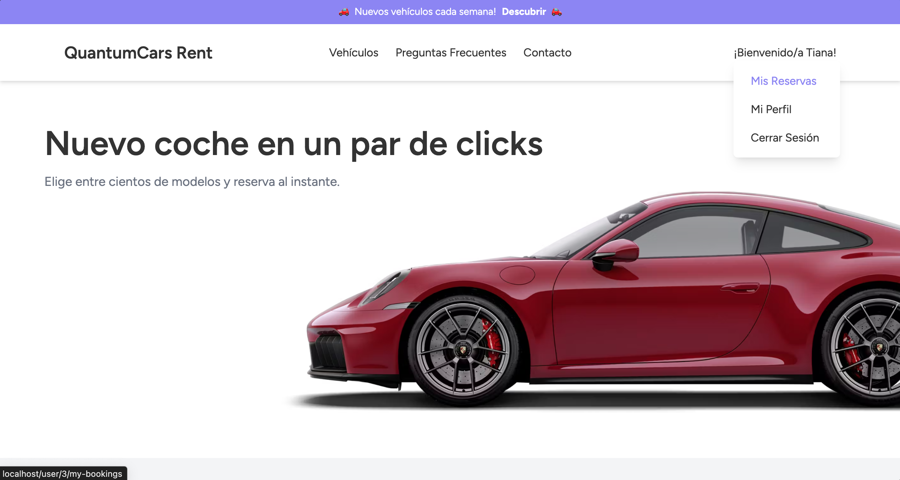
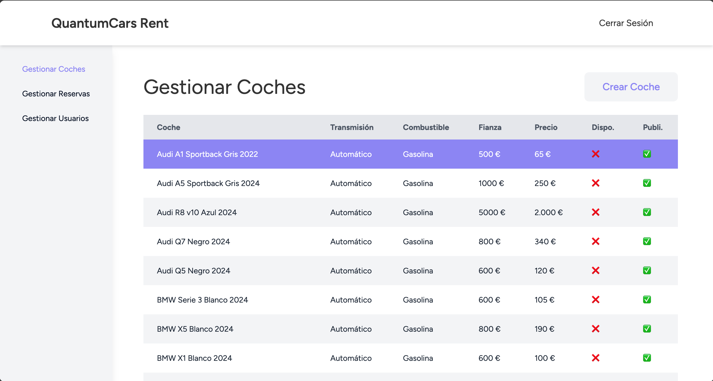

# QuantumCars Rent 

**QuantumCars** es una plataforma de alquiler de coches que permite a los usuarios explorar, reservar y gestionar vehículos de forma intuitiva. Diseñada tanto para clientes como para administradores, ofrece una gestión eficiente del servicio de alquiler.  

## 📸 Capturas de pantalla  
A continuación, se muestran algunas capturas de pantalla de las principales funcionalidades de QuantumCars Rent:

### Inicio

*Página principal*

*Página principal - Selector por segmento*

### Login

*Página para iniciar sesión*

### Selección de vehículos

*Listado de vehículos*

### Vehiculo - Detalle

*Vehículo en detalle*

### Reserva - Cesta

*Cesta de la reserva*

### Reserva - Confirmación

*Reserva confirmada con éxito*

### Reserva - Confirmada (Cliente)

*Página de reservas del cliente*

### Gestionar Coches (Admin)

*Página de gestión de coches*

### Gestionar Reservas (Admin)

*Página de gestión de reservas*

## Funcionalidades  
✔️ **Exploración de vehículos** con filtros avanzados.  
✔️ **Sistema de reservas** con confirmación y seguimiento.  
✔️ **Panel de administración** para gestionar la flota y las reservas.  
✔️ **Autenticación** de clientes y administradores.  

## Tecnologías Utilizadas  
- **Frontend:** HTML, CSS, JavaScript, TailwindCSS
- **Backend:** Laravel y Blade  
- **MySQL**: Base de datos para el almacenamiento de vehiculos, reservas y usuarios. (en local)
- **PostgreSQL**: Base de datos para el almacenamiento de vehiculos, reservas y usuarios. (en Render) NO OPERATIVO

## Cosas a tener en cuenta
El proyecto funciona correctamente en local, para ello descargaremos el proyecto, luego abriremos 'Docker Desktop' y iniciaremos el proyecto mediante
- docker compose up

Luego iniciaremos las migraciones con:
- docker compose exec laravel.test php artisan migrate

Luego ya podemos inicar el proyecto con npm install para la parte del front.

### Cosas a tener en cuenta (RENDER)
El proyecto esta subido a Render de manera gratuita, por lo que la base de datos no esta operativa, pero si el proyecto base (tarda en abrir por el modo standby). Para poder hacer el deploy se ha utilizado esta guía:

https://medium.com/@fallen.snitch/free-laravel-11-deployment-on-render-with-docker-6487a9a09e57

